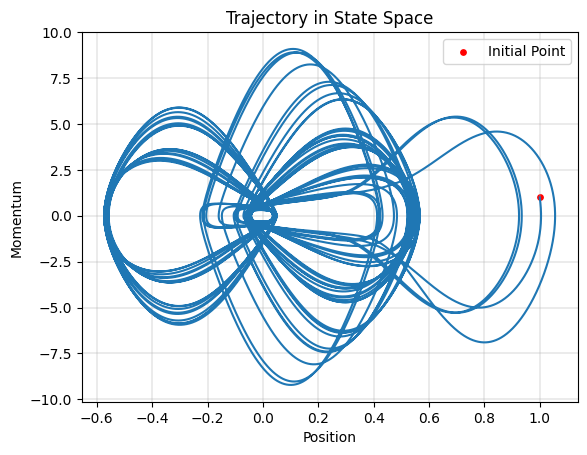
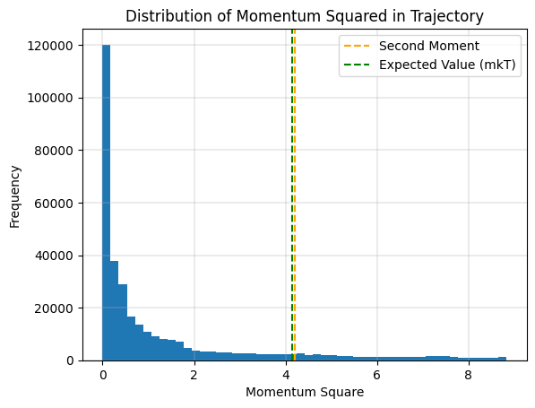
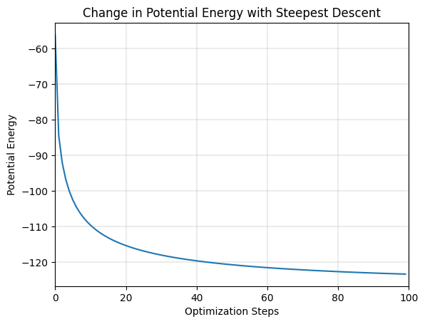
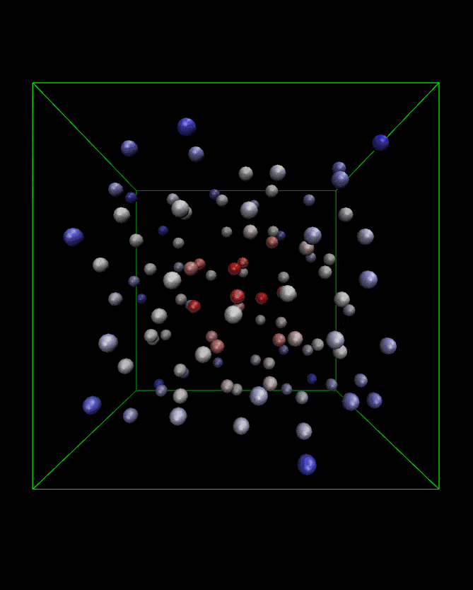
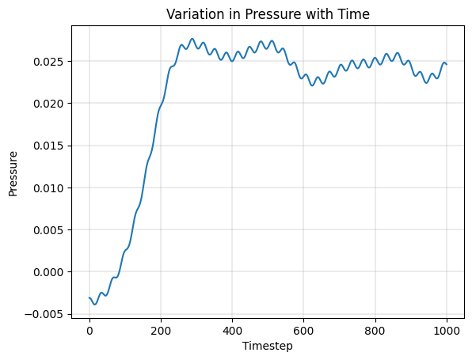
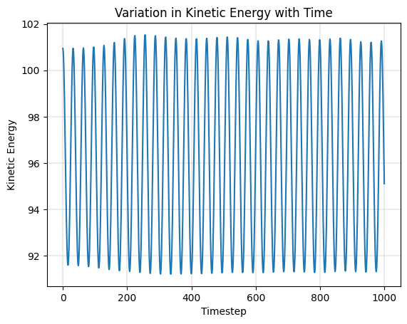
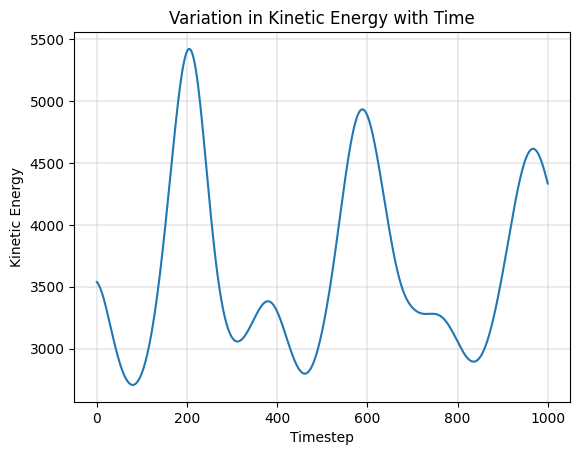

# Molecular Modeling and Simulations

## Hartfree-Fock Method

<table>
    <tr>
        <td align="center"></td>
        <td align="center"></td>
        <td align="center"></td>
    </tr>
    <tr>
        <td align="center"><a href="a1/README.md">Conformational Analysis</a></td>
        <td align="center"><a href="a1/README.md">Vibrational Spectrum of Acetaldehyde</a></td>
        <td align="center"><a href="a1/README.md">H-Bonding in Hydrogen Sulphide</a></td>
    </tr>
</table>

## 1D Harmonic Oscillator - Constant Energy (NVE)

<table>
    <tr>
        <td align="center"></td>
        <td align="center"></td>
        <td align="center"></td>
    </tr>
    <tr>
        <td align="center"><a href="a2/q1/README.md">Trajectory in Phase Space</a></td>
        <td align="center"><a href="a2/q1/README.md">Probability of Accessible Microstates</a></td>
        <td align="center"><a href="a2/q1/README.md">Growth in Number of Accessible Microstates</a></td>
    </tr>
</table>

## 1D Harmonic Oscillator - Constant Temperature (NVT)

<table>
    <tr>
        <td align="center"></td>
        <td align="center"></td>
        <td align="center"></td>
    </tr>
    <tr>
        <td align="center"><a href="a2/q2/README.md">Trajectory in Phase Space</a></td>
        <td align="center"><a href="a2/q2/README.md">Distribution of Momentum Squared</a></td>
        <td align="center"><a href="a2/q2/README.md">Time Evolution of Kinetic Energy</a></td>
    </tr>
</table>

## Lennard Jones System - Constant Energy (NVE)

<table>
    <tr>
        <td align="center"></td>
        <td align="center"></td>
        <td align="center"></td>
    </tr>
    <tr>
        <td align="center"><a href="a2/q3/README.md">Minimization of Lennard Jones Potential</a></td>
        <td align="center"><a href="a2/q3/README.md">NVE Simulation Trajectory</a></td>
        <td align="center"><a href="a2/q3/README.md">Total Energy during Simulation</a></td>
    </tr>
</table>

## Lennard Jones System - Monte Carlo Simulation and Simulated Annealing

<table>
    <tr>
        <td align="center"></td>
        <td align="center"></td>
        <td align="center"></td>
    </tr>
    <tr>
        <td align="center"><a href="a2/q4/README.md">Simulation at 300K</a></td>
        <td align="center"><a href="a2/q4/README.md">Simulation at 200K</a></td>
        <td align="center"><a href="a2/q5/README.md">Simulated Annealing (300K, 250, ..., 100) </a></td>
    </tr>
</table>

## Lennard Jones System - Constant Temperature and Pressure (NPT)

<table>
    <tr>
        <td align="center"></td>
        <td align="center"></td>
        <td align="center"></td>
    </tr>
    <tr>
        <td align="center"><a href="a3/q2/README.md">Minimization of Lennard Jones Potential</a></td>
        <td align="center"><a href="a3/q2/README.md">Pressure during Simulation</a></td>
        <td align="center"><a href="a3/q2/README.md">Kinetic Energy during Simulation</a></td>
    </tr>
</table>

## Simulation of Ice Crystal using SPC/E Water Model - Constant Temperature

<table>
    <tr>
        <td align="center"></td>
        <td align="center"></td>
        <td align="center"></td>
    </tr>
    <tr>
        <td align="center"><a href="a3/q3/README.md">Ice Crystal Supercell</a></td>
        <td align="center"><a href="a3/q3/README.md">Distribution of Momentum during Simulation</a></td>
        <td align="center"><a href="a3/q3/README.md">Kinetic Energy during Simulation</a></td>
    </tr>
</table>
