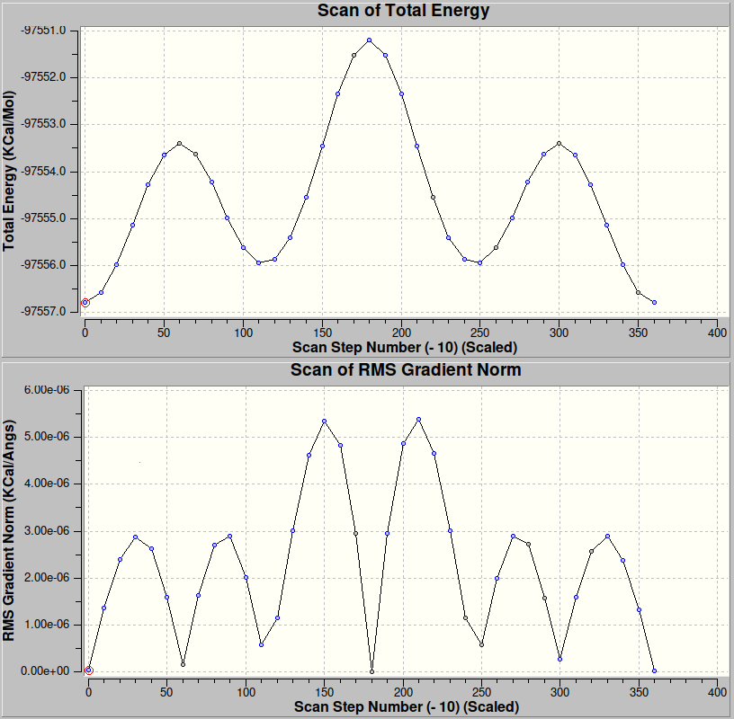
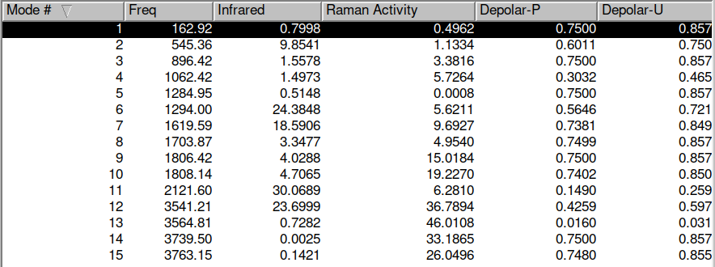
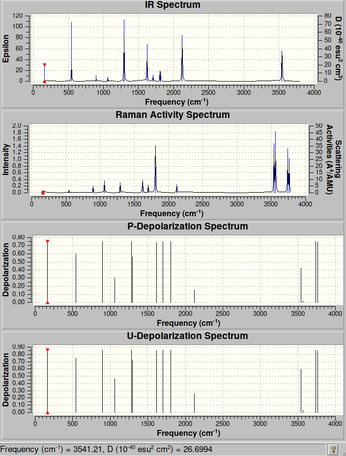

# Assignment 1

Name: Himanshu Singh

Roll Number: 2023121013

## Question 1

Take five organic reactions of your choice, calculate the reaction energies (in kcal/mol), and include the reactions with structures.

### Reaction 1

$$CH_3Br + Cl^- \rightarrow CH_3Cl + Br^-$$

| Molecules | Energy (in a.u.) |
| :-: | --: |
| $CH_3Br$ | -2583.81369428 |
| $Cl^-$ | -454.48042161 |
| $(CH_3ClBr)^-$ | -3038.30454810 |
| $CH_3Cl$ | -493.72311643 |
| $Br^-$ | -2544.53229064 |

Energy of Reactants = -3038.29411589 a.u.

Energy of Transition State = -3038.30454810 a.u.

Energy of Products = -3038.25540707 a.u.

Reaction Energy = 0.03870882 a.u. = 24.2901716382 kcal/mol

Activation Energy = -0.01043221 a.u. = -6.5463160971 kcal/mol

### Reaction 2

$$C_2H_5Br + OH^- \rightarrow C_2H_5OH + Br^-$$

| Molecules | Energy (in a.u.) |
| :-: | --: |
| $C_2H_5Br$ | -2622.39474053 |
| $OH^-$ | -74.06501719 |
| $(C_2H_5BrOH)^-$ | -2695.89152909 |
| $C_2H_5OH$ | -152.13267481 |
| $Br^-$ | -2544.53229064 |

Energy of Reactants = -2696.45975772 a.u.

Energy of Transition State =  -2695.95511133 a.u.

Energy of Products = -2696.66496545 a.u.

Reaction Energy = -0.20520773 a.u. = -128.7699026523 kcal/mol

Activation Energy = 0.56822863 a.u. = 356.5691476113 kcal/mol

### Reaction 3

$$CH_3I + OH^- \rightarrow CH_3OH + I^-$$

| Molecules | Energy (in a.u.) |
| :-: | --: |
| $CH_3I$ | -6889.83984463 |
| $OH^-$ | -74.06501719 |
| $(CH_3IOH)^-$ | -6963.70894514 |
| $CH_3OH$ | -113.54919323 |
| $I^-$ | -6850.60517305 |

Energy of Reactants = -6963.90486182 a.u.

Energy of Transition State = -6963.70894514 a.u.

Energy of Products = -6964.15436628 a.u.

Reaction Energy = -0.24950446 a.u. = 156.5665436946 kcal/mol

Activation Energy = 0.19591668 a.u. = 122.9396758668 kcal/mol

### Reaction 4

$$CH_3Br + I^- \rightarrow CH_3I + Br^-$$

| Molecules | Energy (in a.u.) |
| :-: | --: |
| $CH_3Br$ | -2583.81369428 |
| $I^-$ | -6850.60517305 |
| $(CH_3BrI)^-$ | -9434.38345603 |
| $CH_3I$ | -6889.83984463 |
| $Br^-$ | -2544.53229064 |

Energy of Reactants = -9434.41886733 a.u.

Energy of Transition State = -9434.38345603 a.u.

Energy of Products = -9434.37213527 a.u.

Reaction Energy = 0.04673206 a.u. = 29.3248349706 kcal/mol

Activation Energy = 0.0354113 a.u. = 22.220944863 kcal/mol

### Reaction 5

$$CH_3I + F^- \rightarrow CH_3F + I^-$$

| Molecules | Energy (in a.u.) |
| :-: | --: |
| $CH_3I$ | -6889.83984463 |
| $F^-$ | -97.61331475 |
| $(CH_3IF)^-$ | -6987.49081589 |
| $CH_3F$ | -137.16905607 |
| $I^-$ | -6850.60517305 |

Energy of Reactants = -6987.45315938 a.u.

Energy of Transition State = -6987.49081589 a.u.

Energy of Products = -6987.77422912 a.u.

Reaction Energy = -0.32106974 a.u. = -201.4744725474 kcal/mol

Activation Energy = -0.03765651 a.u. = -23.6298365901 kcal/mol

## Question 2

Perform conformational analysis of butane and plot the energy (in kcal/mol) as a function of the rotation angle.

## Question 3

Calculate the energy difference between the chair and boat forms of cyclohexane.

Energy of Chair Cyclohexane = -231.48267163 a.u.

Energy of Boat Cyclohexane = -231.47297425 a.u.

Energy Difference = 0.00969738 a.u. = 6.0852029238 kcal/mol

The boat form is thus less stable than the chair form. The energy difference calculated to be 25.46kJ/mol is close to the theoretical value of 23kJ/mol ([source](https://chem.libretexts.org/Bookshelves/Organic_Chemistry/Organic_Chemistry_(Morsch_et_al.)/04%3A_Organic_Compounds_-_Cycloalkanes_and_their_Stereochemistry/4.05%3A_Conformations_of_Cyclohexane#:~:text=not%20completely%20staggered.-,Though%20more%20stable,.,-A%20twist-boat)).

## Question 4

Calculate the vibrational spectrum of Acetaldehyde, obtain the experimental spectrum and compare the two.

## Question 5

Hydrogen bond between two water molecules are stronger than that between two hydrogen sulfide molecules. Prove.
