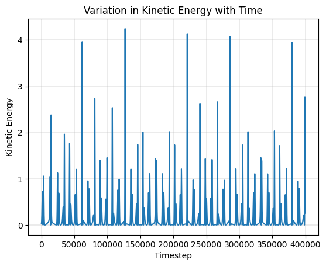
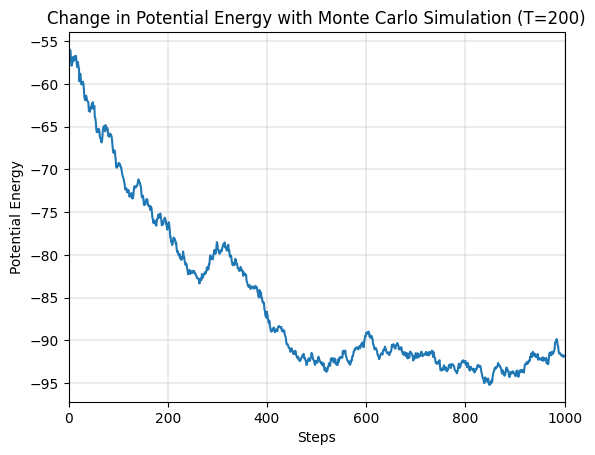
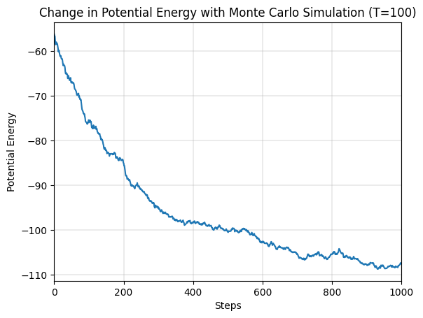
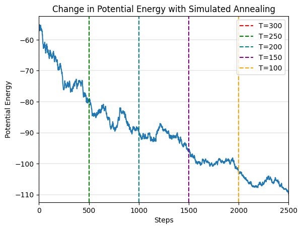
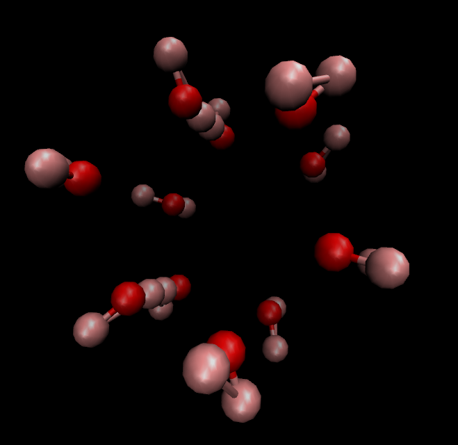

# 1D Harmonic Oscillator - Constant Energy (NVE)

<table>
    <tr>
        <td align="center"></td>
        <td align="center"></td>
        <td align="center"></td>
    </tr>
    <tr>
        <td align="center"><a href="q1/README.md">Trajectory in Phase Space</a></td>
        <td align="center"><a href="q1/README.md">Probability of Accessible Microstates</a></td>
        <td align="center"><a href="q1/README.md">Growth in Number of Accessible Microstates</a></td>
    </tr>
</table>

# 1D Harmonic Oscillator - Constant Temperature (NVT)

<table>
    <tr>
        <td align="center"></td>
        <td align="center"></td>
        <td align="center"></td>
    </tr>
    <tr>
        <td align="center"><a href="q2/README.md">Trajectory in Phase Space</a></td>
        <td align="center"><a href="q2/README.md">Distribution of Momentum Squared</a></td>
        <td align="center"><a href="q2/README.md">Time Evolution of Kinetic Energy</a></td>
    </tr>
</table>

# Lennard Jones System - Constant Energy (NVE)

<table>
    <tr>
        <td align="center"></td>
        <td align="center"></td>
        <td align="center"></td>
    </tr>
    <tr>
        <td align="center"><a href="q3/README.md">Distribution of Initial Distances</a></td>
        <td align="center"><a href="q3/README.md">Minimization of Lennard Jones Potential</a></td>
        <td align="center"><a href="q3/README.md">NVE Simulation Trajectory</a></td>
    </tr>
</table>

# Lennard Jones System - Monte Carlo Simulation

<table>
    <tr>
        <td align="center"></td>
        <td align="center"></td>
        <td align="center"></td>
    </tr>
    <tr>
        <td align="center"><a href="q4/README.md">Simulation at 300K</a></td>
        <td align="center"><a href="q4/README.md">Simulation at 200K</a></td>
        <td align="center"><a href="q4/README.md">Simulation at 100K</a></td>
    </tr>
</table>

# Lennard Jones System - Simulated Annealing

<table>
    <tr>
        <td align="center"></td>
    </tr>
    <tr>
        <td align="center"><a href="q5/README.md">Simulated Annealing (300K, 250, ..., 100) </a></td>
    </tr>
</table>

# Generation of Ice Crystal

<table>
    <tr>
        <td align="center"></td>
        <td align="center"></td>
    </tr>
    <tr>
        <td align="center"><a href="q6/README.md">Single Cell</a></td>
        <td align="center"><a href="q6/README.md">Supercell (made of 8 cells) </a></td>
    </tr>
</table>
