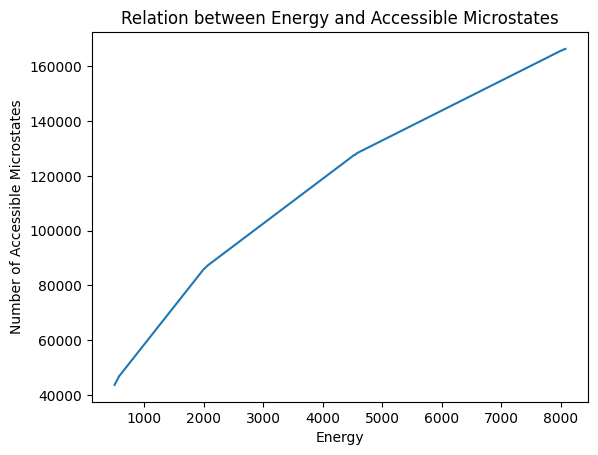

# 1D Harmonic Oscillator - Constant Energy (NVE)

## Time Evolution in the Phase Space

Repeated application of Hamilton's equation for updating the position and momentum results in an elliptical trajectory as follows. This was expected as the energy is a function of sum of square of displacement (assume mean position to be 0) and square of momentum. Fixing the energy to be constant gives the equation of an ellipse.

$$\frac{k(x - x_0)^2}{2} + \frac{p^2}{2m} = E$$

## Probability of Encountering an Accessible Microstate

According to the Boltzmann's distribution, the probability of isoenergy states is constant. Computation of empirical probabilties and visualizing the box plot shows that this holds true to a reasonable extent in simulation (note that the median probability overlaps with the uniform probability).

## Number of Accessible Microstates as a function of Energy

Varying the initial conditions and conducting constant energy simulations revealed a sublinear growth in the number of accessible microstates. This was again expected from the geometric interpretation of the trajectory, which follows the circumference of the ellipse. The circumference of the ellipse is given by $\pi (a + b)$, where $a$ and $b$ represent the lengths of the semi-axes. We can rearrange the earlier equation to reveal that both $a, b$ are functions of $\sqrt{E}$, thus validating the sublinear growth.

$$\frac{k(x - x_0)^2}{\left(\sqrt{2E / k}\right)^2} + \frac{p^2}{\left(\sqrt{2mE}\right)^2} = 1$$

