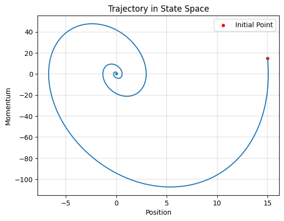
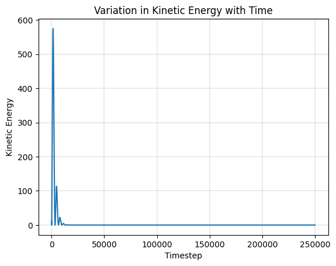
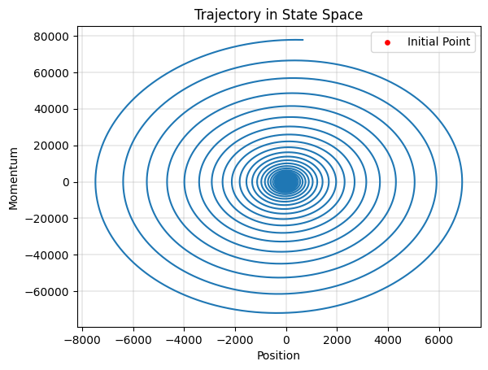
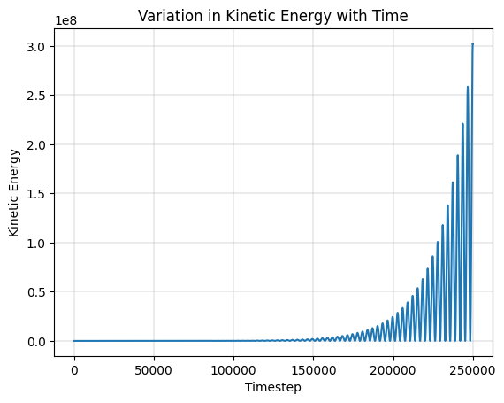
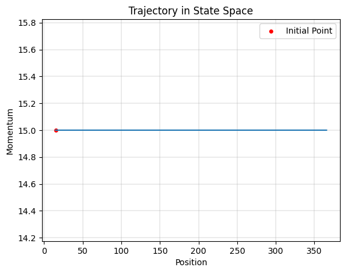
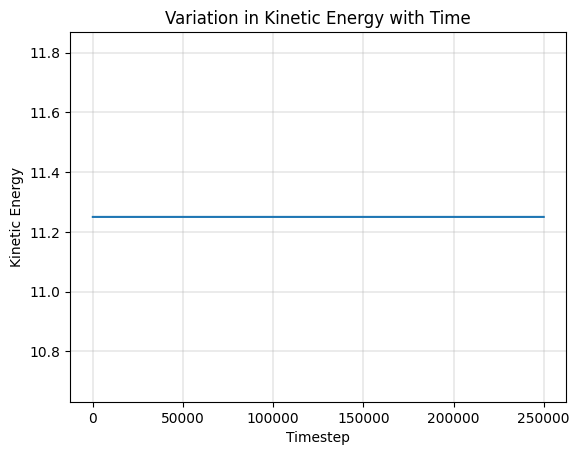
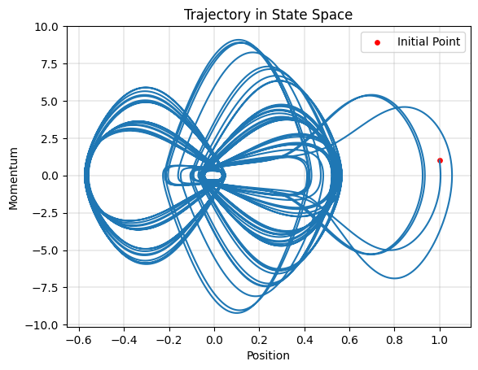
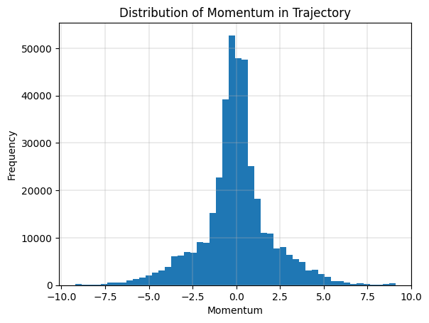
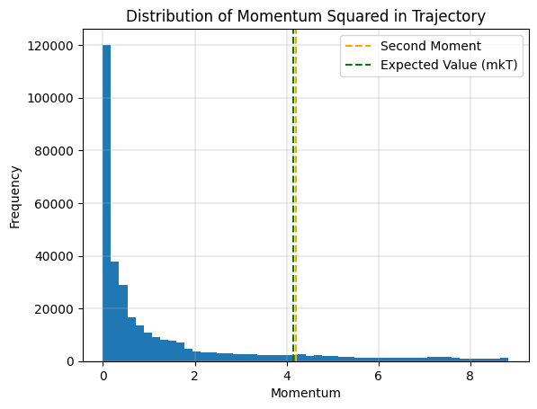
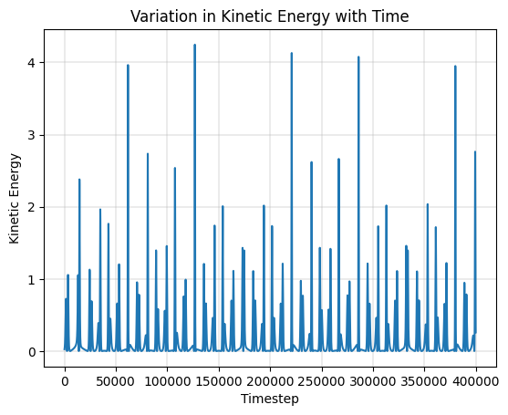

# 1D Harmonic Oscillator - Constant Temperature (NVT)

Assuming kinetic energy to be a function of temperature, we would the average kinetic energy (or equivalently the momentum) to be constant. However, we would still to have some exploration in the phase space. We will thus consider addition of a new force in the Hamilton's equation to model this.

$$\frac{dp}{dt} = - \frac{\partial U(x)}{\partial x} - \alpha p$$

The second term would ensure the change in momentum opposes the current direction of momentum. To get this working, we will have to explore different strategies of setting the variable $\alpha$.

## Constant Positive Value

$$\alpha > 0$$

As predicted earlier, the new update equation causes the momentum to dampen to zero due to its opposing nature. Since the particle (position) has a tendency to oscillate we still see an elliptical-like path, albeit a shrinking one.

## Constant Negative Value

$$\alpha < 0$$

Similar to the previous case, the update equation (due to the negation) will now cause the momentum to rapidly increase with a rate proportional to its current value. This results in an exponential blow up in the momentum and kinetic energy.

## Isokinetic Method

$$\alpha = \dfrac{F \cdot p}{p \cdot p}$$

Using the above equation for varying the value of $\alpha$ sets the change in momentum to be precisely zero. This achieves the objective of maintaining a constant temperature, although at the cost of exploration. Interestingly, the particular no longer oscillates back to the inital position as that would require the momentum of the particle to dampen and change its direction.

## Nose-Hoover Thermostat

$$\dfrac{d\alpha}{dt} = \dfrac{1}{Q} \left( \dfrac{p^2}{m} - k_B T \right), Q \geq 0$$

Using the above equation for varying the value of $\alpha$ helps overcome the lack of exploration in the isokinetic method by allowing some exploration. As evident in the equation, it balances between the instantaneous kinetic energy (first term in the difference) and the average kinetic energy (second term in the difference).

From the visualization, we notice a good amount of exploration in the phase space, momentum following a zero-centered gaussian like distribution, second moment of momentum\* being close to the expected value, and kinetic energy defaulting to zero (see the flat lines after the spikes).

\*Note that outliers (the ones also responsible for the spikes in the kinetic energy plot) were filtered for this particular plot.

