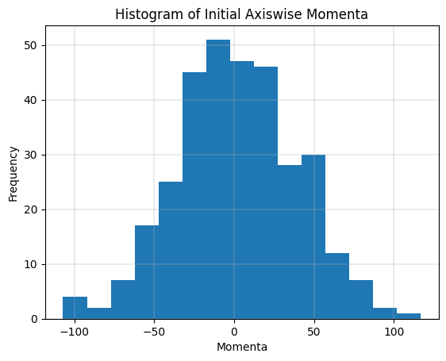
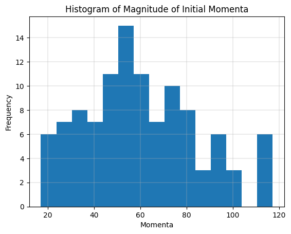

# Lennard Jones System - Constant Energy (NVE)

## Initial Configuration

Initial configuration of position and momenta can be generated by sampling from uniform and normal distribution respectively. In the case of position however, merely sampling in $[0, L]$ does not suffice. We will have to reject samples that lead to overlap with other atoms (or the "permissible distance" in the plots) and sample again.

The distribution of magnitude of momenta sampled this way roughly resembles the Maxwell-Boltzmann distribution, as one would expect ([source](https://physics.stackexchange.com/a/536497)).

## Minimization of Potential Energy

The randomly generated configurations can be improved upon by the use of gradient based minimization on the potential energy surface.

## NVE Simulation Trajectory

Hamilton's equation were applied on the optimized configuration to generate a trajectory, visualized in VMD as follows.

