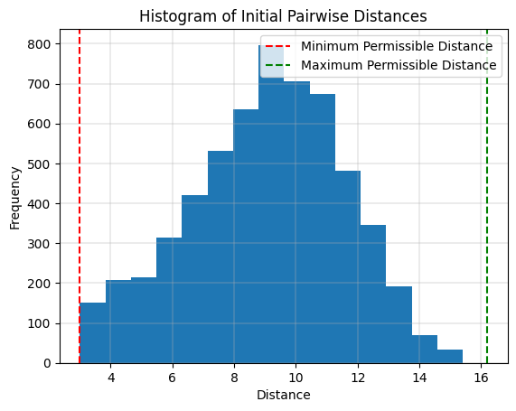
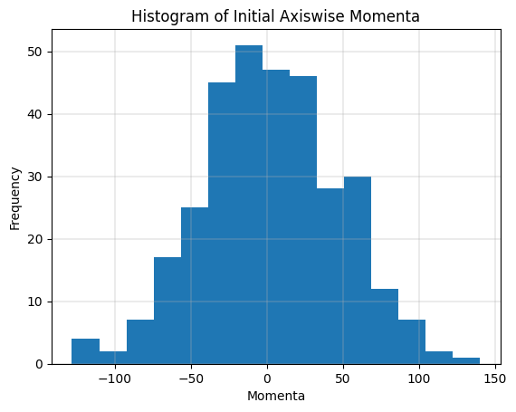
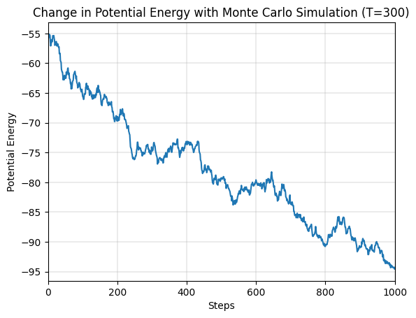
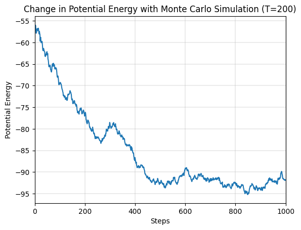
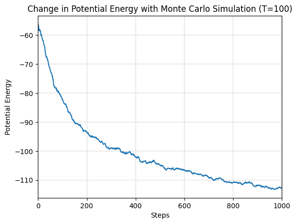

# Lennard Jones System - Monte Carlo Simulation

## Initial Configuration

Initial configuration of position and momenta can be generated by sampling from uniform and normal distribution respectively. In the case of position however, merely sampling in $[0, L]$ does not suffice. We will have to reject samples that lead to overlap with other atoms (or the "permissible distance" in the plots) and sample again.

The distribution of magnitude of momenta sampled this way roughly resembles the Maxwell-Boltzmann distribution, as one would expect ([source](https://physics.stackexchange.com/a/536497)).

## Minimization of Potential Energy

The randomly generated configurations can be improved upon by the use of Monte Carlo simulation with rejection sampling. The undesirable high energy energy configurations ($\Delta U > 0$) are accepted only with an exponentially decreasing probability.

$$p = e^{- \Delta U / (k_B T)}$$

Consequently, at higher temperatures, we are more likely to explore by accepting the unstable higher energy configurations. In the longer run, this can help escape local minimas and plateaus. While exploration may be desirable during the initial steps of minimization, it will make the convergence very slow. This prompts the necessity of a gradual cooldown in temperature, as we become more confident of our current estimates.

