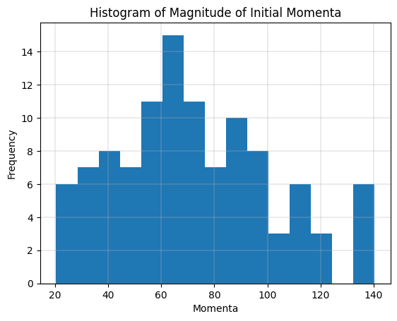

# Lennard Jones System - Simulated Annealing

## Initial Configuration

Initial configuration of position and momenta can be generated by sampling from uniform and normal distribution respectively. In the case of position however, merely sampling in $[0, L]$ does not suffice. We will have to reject samples that lead to overlap with other atoms (or the "permissible distance" in the plots) and sample again.

The distribution of magnitude of momenta sampled this way roughly resembles the Maxwell-Boltzmann distribution, as one would expect ([source](https://physics.stackexchange.com/a/536497)).

## Minimization of Potential Energy

The randomly generated configurations can be improved upon by the use of Simulated Annealing. As noted in the earlier question, this helps us strike a perfect balance between exploration and convergence. As our estimate becomes better, random exploration become less likely to lead us to a better configuration. Thus, we can start to discard the undesirable higher energy configurations more often than before.

## Comparision with Steepest Descent

We notice that Simulated Annealing have converged to an energy level similar to what we achieved with steepest descent. However, this comes at the cost of 5000\* steps of Simulated Annealing (against the 100 steps of Steepest Descent). Recall both while Simulated Annealing requires computation of the potential energy at every step, Steepest Descent requires computation of the potential energy gradient - both of which have a similar computational complexity. We can thus argue the informed updates of Steepest Descent outperformed the slower updates of Simulated Annealing in this experimental setup.

\*One should note that the success of simulated annealing depends on the choice of temperature as much as that the success of steepest descent depends on the learning rate. A single run of simulated annealing alone cannot be sufficient for drawing a conclusion.

## Appendix

Time taken by each algorithm in current experimental setup:
- Steepest Descent (100 steps): 60 seconds
- Monte Carlo @ 300K (1000 steps): 240 seconds
- Monte Carlo @ 200K (1000 steps): 250 seconds
- Simulated Annealing @ 300-100K (5000 steps): 1225 seconds
