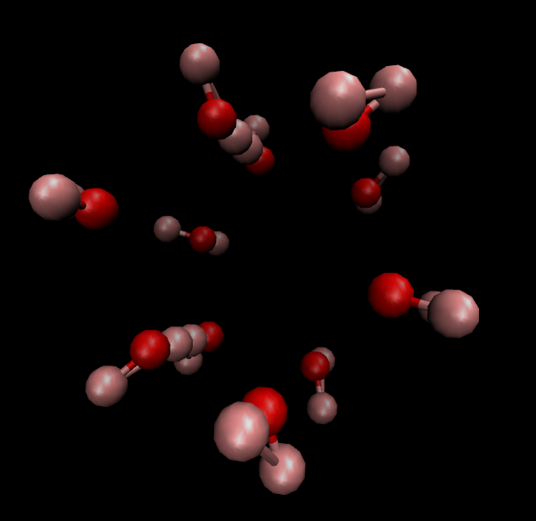
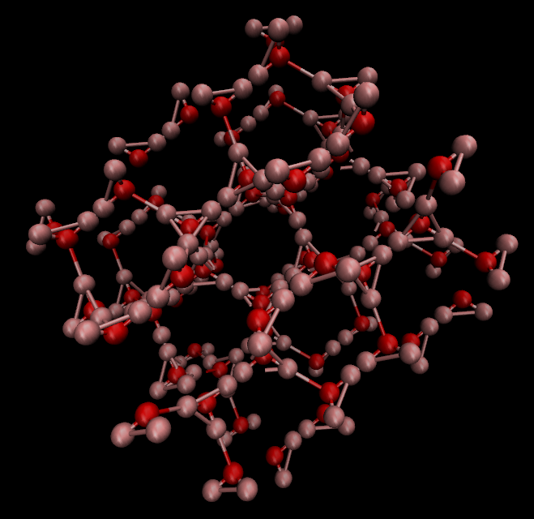

# Generation of Ice Crystal

## Data

The following data was extracted from the experimental results.

```
a: 4.513, b: 4.513, c: 7.355
alpha: 90.0, beta: 90.0, gamma: 120.0
fract: [('O2-', array([0.3333, 0.6667, 0.0629])),
        ('D1+', array([0.3333, 0.6667, 0.1989])),
        ('D1+', array([0.4551, 0.9102, 0.0182]))]
```

## H-Matrix

The H-Matrix constructed was as follows.

```
h-matrix: [[ 4.51300000e+00  0.00000000e+00  0.00000000e+00]
           [-2.25650000e+00  3.90837265e+00  0.00000000e+00]
           [ 4.50363860e-16  7.80053088e-16  7.35500000e+00]]
Determinant: 129.73
Scalar Triple Product: 129.73
```

## Visualization

The ice crystal constructed was visualized in VMD as follows.



Repeating the same multiple times (two in this case) along the three axes of the lattice gives us a supercell, visualized as follows.


