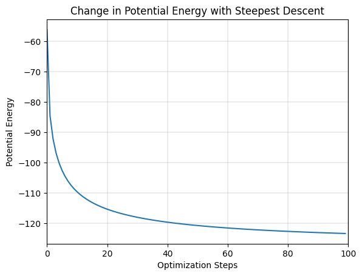
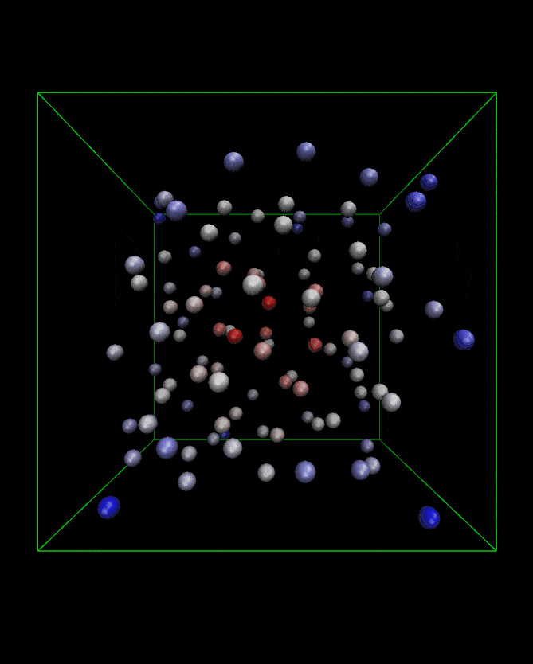
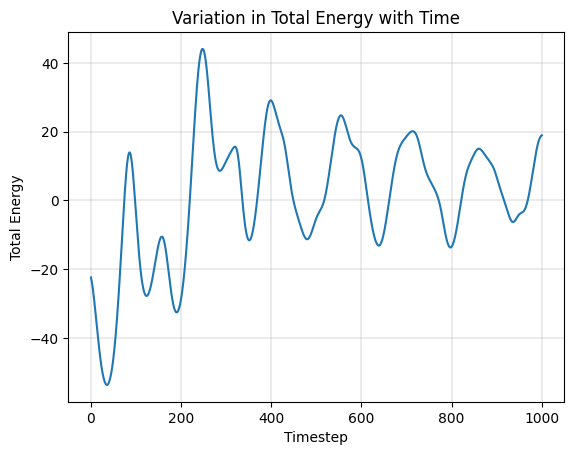
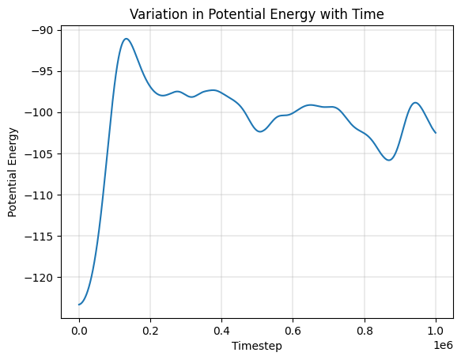
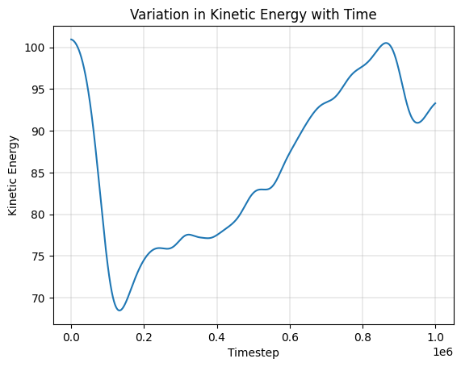
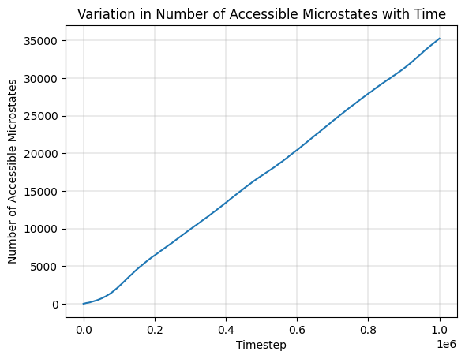

# Lennard Jones System - Constant Temperature (NVT)

<table>
    <tr>
        <td align="center"></td>
        <td align="center"></td>
        <td align="center"></td>
    </tr>
    <tr>
        <td align="center"><a href="q1/README.md">Minimization of Lennard Jones Potential</a></td>
        <td align="center"><a href="q1/README.md">NVT Simulation Trajectory</a></td>
        <td align="center"><a href="q1/README.md">Kinetic Energy during Simulation</a></td>
    </tr>
</table>

# Lennard Jones System - Constant Temperature and Pressure (NPT)

# Simulation of Ice Crystal using SPC/E Water Model - Constant Temperature

# Counting the Accessible Microstates of an Isolated Lennard Jones System in a Cubic Volume

<table>
    <tr>
        <td align="center"></td>
        <td align="center"></td>
        <td align="center"></td>
    </tr>
    <tr>
        <td align="center"><a href="q4/README.md">Potential Energy during Simulation</a></td>
        <td align="center"><a href="q4/README.md">Kinetic Energy during Simulation</a></td>
        <td align="center"><a href="q4/README.md">Number of Accessible Microstates</a></td>
    </tr>
</table>
