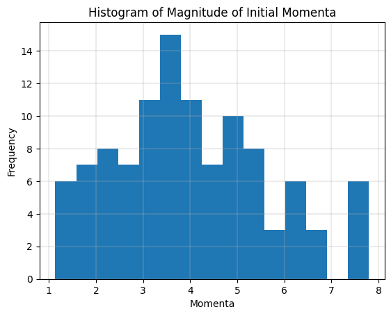
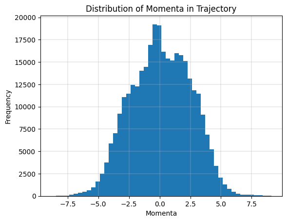
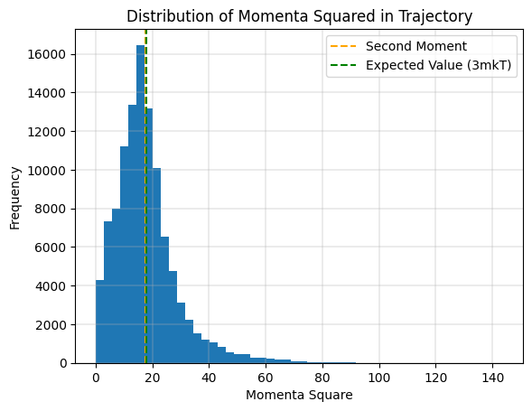
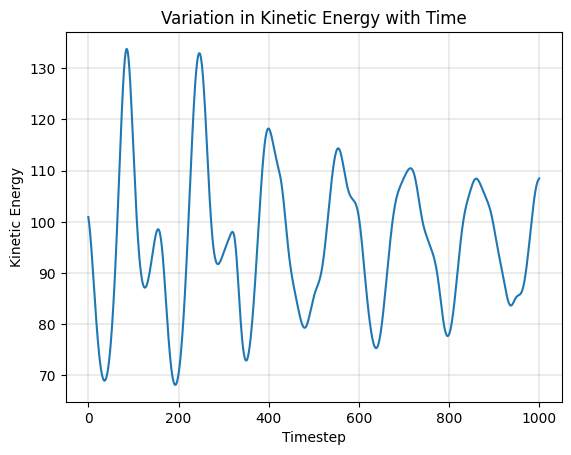
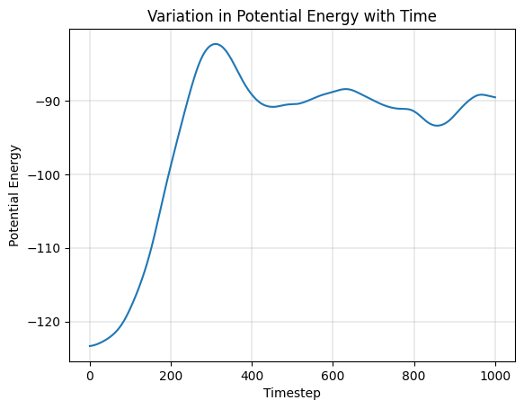
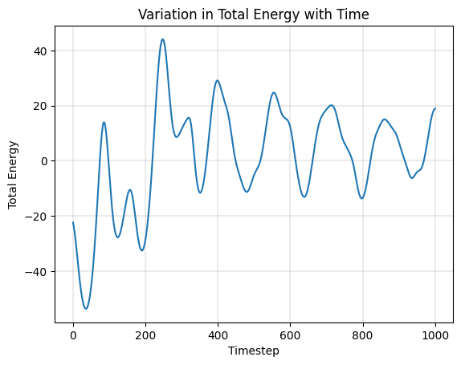

# Lennard Jones System - Constant Temperature (NVT)

## Initial Configuration

Initial configuration of position and momenta can be generated by sampling from uniform and normal distribution respectively. In the case of position however, merely sampling in $[0, L]$ does not suffice. We will have to reject samples that lead to overlap with other atoms (or the "permissible distance" in the plots) and sample again.

The distribution of magnitude of momenta sampled this way roughly resembles the Maxwell-Boltzmann distribution, as one would expect ([source](https://physics.stackexchange.com/a/536497)).

## Minimization of Potential Energy

The randomly generated configurations can be improved upon by the use of gradient based minimization on the potential energy surface.

## NVT Simulation Trajectory

Hamilton's equation coupled with Nose-Hoover Thermostat were applied on the optimized configuration to generate a trajectory, visualized in VMD as follows.

The evolution of momenta was as follows. We observe it follows the same properties as it did in the case of a single one dimensional particle, i.e. first and second moment close to zero and proportional to temperature respectively.

The evolution of energy metrics were as follows.

Based on the plots of energy and momenta, we can argue that the objective of constant temperature simulation was achieved to a reasonable extent.
