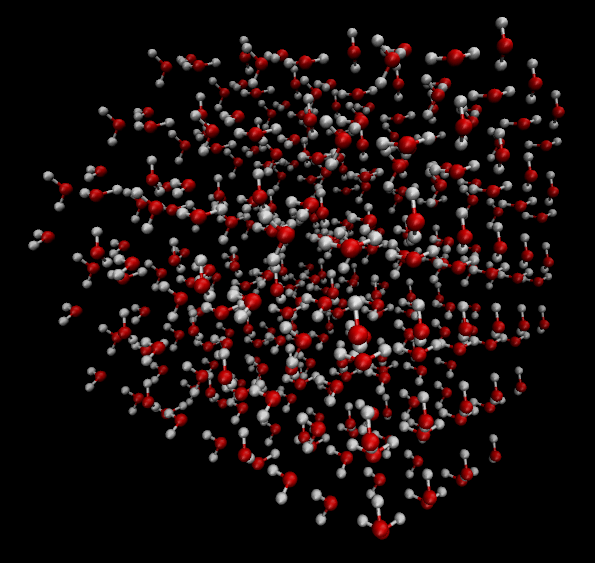
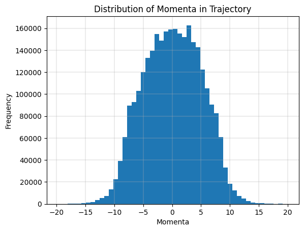
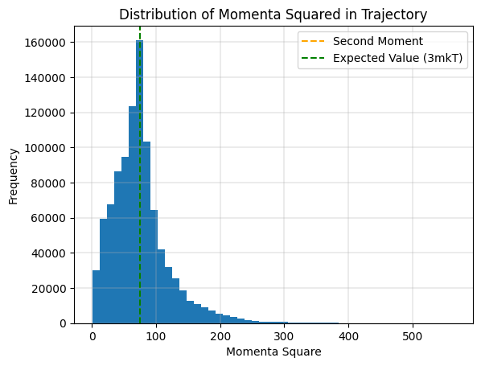
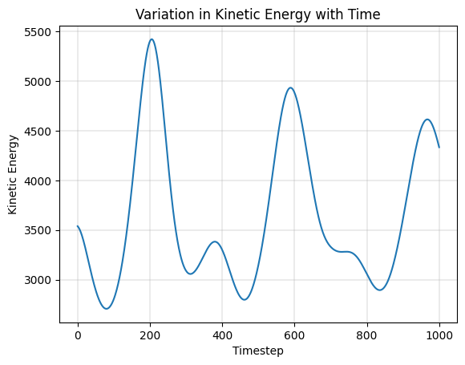
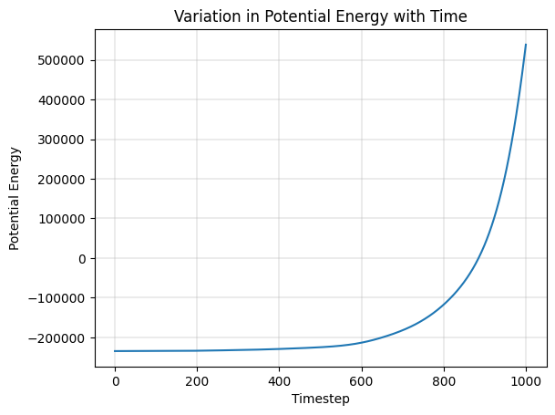

# Simulation of Ice Crystal using SPC/E Water Model - Constant Temperature

## Ice Crystal

For the simulation, we used the ice crystal from the [UIUC website](http://www.ks.uiuc.edu/Training/CaseStudies/). Their input file consists of all atoms arranged by their molecule rather than element. This makes it easy to draw associations between bonded atoms and find their bond lengths (for example). The crystal supercell is visualized in VMD as follows.



## SPC/E Water Model

We used the SPC/E paramters from [LSBU website](https://water.lsbu.ac.uk/water/water_models.html). The values used were as follows.

```
eps = 0.650         # kJ/mol
sigma = 3.166       # Angstrom
q_H = 0.4236
q_O = -0.8476
l_0 = 1.0000        # Angstrom
theta_0 = 109.47    # Degrees
```

## Constant Temperature Simulation

Hamilton's equation were applied to generate a trajectory.

The evolution of momenta was as follows. We observe it follows the same properties as it did in the case of a single one dimensional particle, i.e. first moment close to zero and second moment proportional to temperature.





The evolution of energy metrics were as follows.






Based on the plots of energy and momenta, we can argue that the objective of constant temperature simulation was achieved to a reasonable extent.
