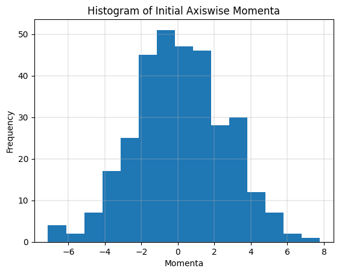

# Counting the Accessible Microstates of an Isolated Lennard Jones System in a Cubic Volume

## Initial Configuration

Initial configuration of position and momenta can be generated by sampling from uniform and normal distribution respectively. In the case of position however, merely sampling in $[0, L]$ does not suffice. We will have to reject samples that lead to overlap with other atoms (or the "permissible distance" in the plots) and sample again.

The distribution of magnitude of momenta sampled this way roughly resembles the Maxwell-Boltzmann distribution, as one would expect ([source](https://physics.stackexchange.com/a/536497)).

## Minimization of Potential Energy

The randomly generated configurations can be improved upon by the use of gradient based minimization on the potential energy surface.

## NVE Simulation Trajectory

Hamilton's equation were applied on the optimized configuration to generate a trajectory. The evolution of energy metrics were as follows.

We notice that even for a small time step of $t = 0.00001$, Taylor series approximation of Hamilton's rules do not yield very good results for a long trajectory.

## Counting the Number of Accessible Microstates

The state space was discretized to a 648 dimensional grid, with grid size of 0.1. The states visited were tracked throughout the simulation by storing them in a set data structure. The growth in the number of states accessed so far was recorded as follows.

We notice that a simulation of 1000000 steps is not sufficient for sampling all possible accessible microstates, despite a large grid size. This is partly due to the small step size chosen for updates. However, larger step sizes lead to a large blow up in total energy, which would further increase the microstates that could be accessed. We can thus argue that empirical counting is not a stable method to achieve our objective.
